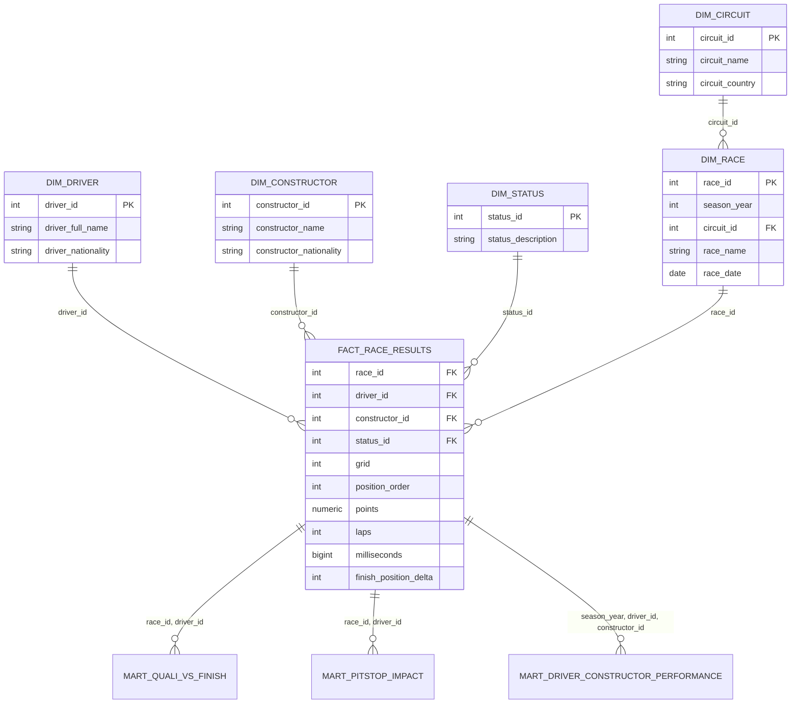

# Phase 2 Star Schema Diagram

```mermaid
erDiagram
    DIM_DRIVER ||--o{ FACT_RACE_RESULTS : "driver_id"
    DIM_CONSTRUCTOR ||--o{ FACT_RACE_RESULTS : "constructor_id"
    DIM_STATUS ||--o{ FACT_RACE_RESULTS : "status_id"
    DIM_RACE ||--o{ FACT_RACE_RESULTS : "race_id"
    DIM_CIRCUIT ||--o{ DIM_RACE : "circuit_id"

    FACT_RACE_RESULTS ||--o{ MART_QUALI_VS_FINISH : "race_id, driver_id"
    FACT_RACE_RESULTS ||--o{ MART_PITSTOP_IMPACT : "race_id, driver_id"
    FACT_RACE_RESULTS ||--o{ MART_DRIVER_CONSTRUCTOR_PERFORMANCE : "season_year, driver_id, constructor_id"

    DIM_DRIVER {
      int driver_id PK
      string driver_full_name
      string driver_nationality
    }

    DIM_CONSTRUCTOR {
      int constructor_id PK
      string constructor_name
      string constructor_nationality
    }

    DIM_STATUS {
      int status_id PK
      string status_description
    }

    DIM_CIRCUIT {
      int circuit_id PK
      string circuit_name
      string circuit_country
    }

    DIM_RACE {
      int race_id PK
      int season_year
      int circuit_id FK
      string race_name
      date race_date
    }

    FACT_RACE_RESULTS {
      int race_id FK
      int driver_id FK
      int constructor_id FK
      int status_id FK
      int grid
      int position_order
      numeric points
      int laps
      bigint milliseconds
      int finish_position_delta
    }
```
